# Thinking in LangGraph

A visual walkthrough — built to read like slides.  
**Worked example:** an HR agent that screens a résumé and decides interview vs. rejection.

---

## 1 · Why do we even need LangGraph?

A plain agent gets **one big toolbox** and has to choose the right tool on every single turn. The more tools you add, the more chances it has to choose wrong.

### Without a graph — one agent, every tool, every turn

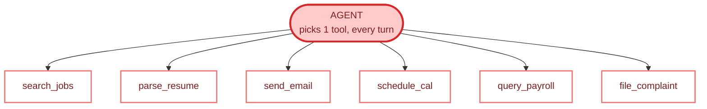


**6 tools to choose from on every step → more wrong turns → harder to debug.**

### With LangGraph — fixed steps, only the tools each step needs

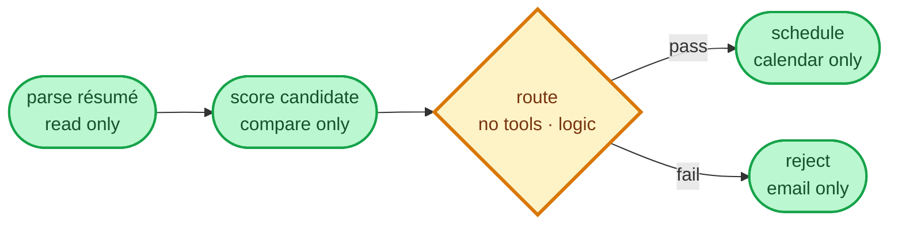


**At most 1–2 tools per step → fewer choices → fewer mistakes.**

**The core idea:** LangGraph turns a loose chatbot into a **pipeline**. You decide *what happens*, *in what order*, and *what data flows* — instead of hoping the model navigates a dozen tools correctly.

---

## 2 · The main three words you need


| Word         | In one word | What it is                                                    |
| ------------ | ----------- | ------------------------------------------------------------- |
| 📓 **STATE** | information | The shared **notebook** every step reads from and writes to.  |
| ⚙️ **NODE**  | action      | One **worker** that does one job, then hands the notebook on. |
| ➡️ **EDGE**  | connection  | The **arrow** that decides which node runs next.              |


---

## 3 · How to think before you write code

Designing an agent is answering five questions in order. Each answer produces a concrete piece of the graph.

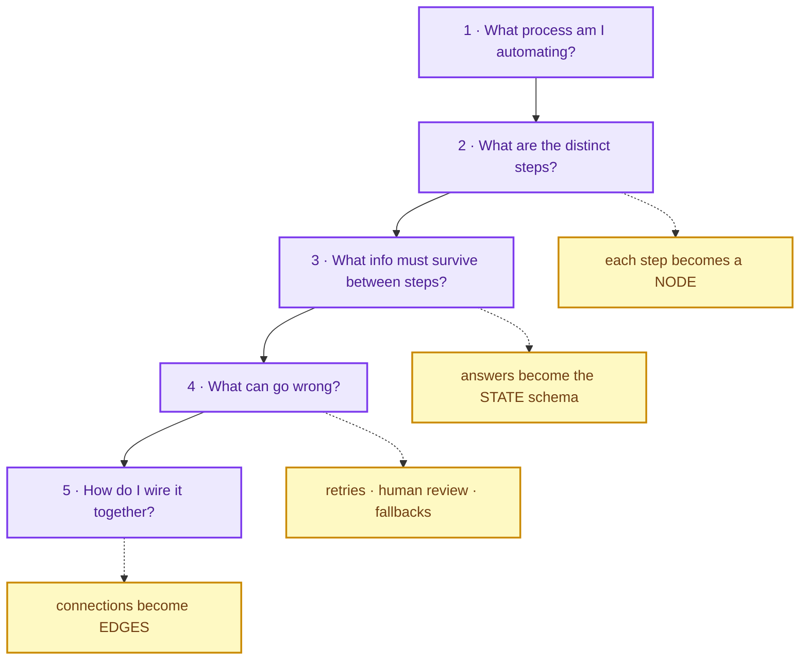


| #   | Question        | What you produce                                       |
| --- | --------------- | ------------------------------------------------------ |
| 1   | What process?   | A one-line goal — *"Screen incoming job applications"* |
| 2   | What steps?     | A node list — parse → score → route → act              |
| 3   | What data?      | A `TypedDict` state schema                             |
| 4   | What errors?    | Retry policy, rejection path, human review             |
| 5   | How to connect? | Edges + one conditional branch                         |


---

## 4 · Our example: an HR recruitment agent

**Goal:** screen a résumé for a *Python Developer* role and either book an interview or send a polite rejection.

Here is the **finished graph** — the end result we build step by step in this guide. Keep this picture in mind as you read the rest.

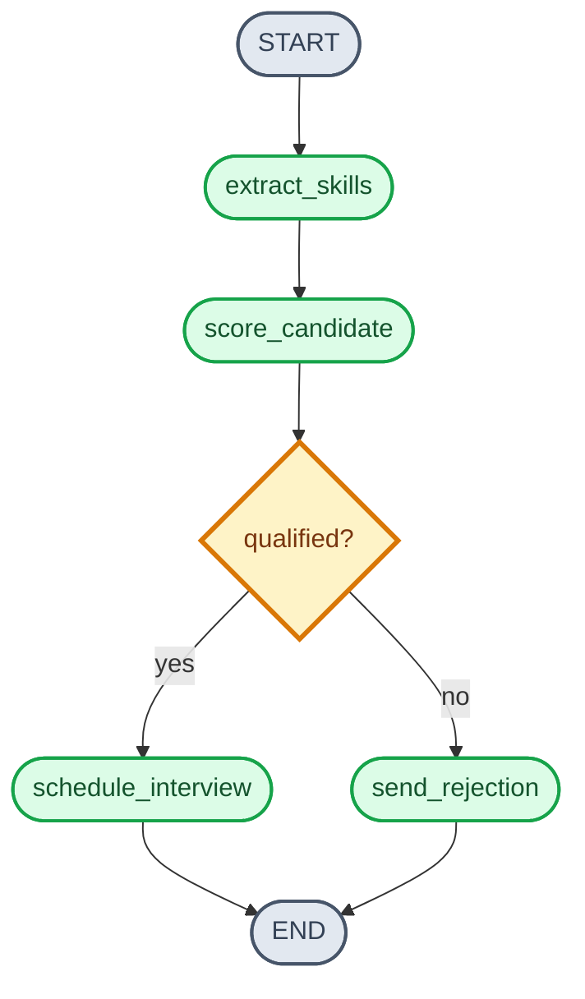


| Step | Node                 | What it does                                      |
| ---- | -------------------- | ------------------------------------------------- |
| 1    | `extract_skills`     | Pull skill keywords out of the résumé text        |
| 2    | `score_candidate`    | Compare found skills against the job requirements |
| 3    | *(routing)*          | Pass → schedule · Fail → reject                   |
| 4a   | `schedule_interview` | Book an interview slot                            |
| 4b   | `send_rejection`     | Draft a polite decline email                      |


---

## 5 · STATE — the shared notebook

**Rule of thumb:** store **raw facts** in state (text, lists, scores). Build prompts and formatted strings *inside* nodes, never in state.

```python
from typing import Literal, TypedDict


class RecruitmentState(TypedDict):
    # INPUT — you provide these at the start
    candidate_name: str
    resume_text: str
    job_title: str
    required_skills: list[str]

    # WRITTEN BY extract_skills
    skills_found: list[str] | None

    # WRITTEN BY score_candidate
    match_score: float | None
    qualified: bool | None

    # WRITTEN BY schedule_interview / send_rejection
    outcome: Literal["interview", "rejected"] | None
    message: str | None
```


|                           |                                            |                                                  |                                             |
| ------------------------- | ------------------------------------------ | ------------------------------------------------ | ------------------------------------------- |
| **INPUT** **you provide** | **extract_skills** **writes skills_found** | **score_candidate** **writes score + qualified** | **final node** **writes outcome + message** |


**Agent state** *(Anna Kowalski — at START, before any node runs)*


| Field             | Value                                             |
| ----------------- | ------------------------------------------------- |
| `candidate_name`  | `"Anna Kowalski"`                                 |
| `resume_text`     | `"5 years Python, FastAPI, SQL, Docker, pytest."` |
| `job_title`       | `"Python Developer"`                              |
| `required_skills` | `["python", "sql", "fastapi"]`                    |
| `skills_found`    | `null`                                            |
| `match_score`     | `null`                                            |
| `qualified`       | `null`                                            |
| `outcome`         | `null`                                            |
| `message`         | `null`                                            |


---

## 6 · NODE 1 — extract skills

A node is just a function: it **reads** from state, does work, and **returns only the keys it changed**.

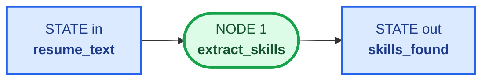


**Reads** resume_text  ·  **Writes** skills_found  ·  **Edge** always → Node 2

```python
KEYWORDS = {"python", "sql", "fastapi", "docker", "pytest", "langchain"}


def extract_skills(state: RecruitmentState) -> dict:
    text = state["resume_text"].lower()
    found = [kw for kw in KEYWORDS if kw in text]
    return {"skills_found": found}
```

**Agent state** *(Anna Kowalski — after `extract_skills`)*


| Field             | Value                                              |
| ----------------- | -------------------------------------------------- |
| `candidate_name`  | `"Anna Kowalski"`                                  |
| `resume_text`     | `"5 years Python, FastAPI, SQL, Docker, pytest."`  |
| `job_title`       | `"Python Developer"`                               |
| `required_skills` | `["python", "sql", "fastapi"]`                     |
| `skills_found`    | `["python", "fastapi", "sql", "docker", "pytest"]` |
| `match_score`     | `null`                                             |
| `qualified`       | `null`                                             |
| `outcome`         | `null`                                             |
| `message`         | `null`                                             |


---

## 7 · NODE 2 — score the candidate

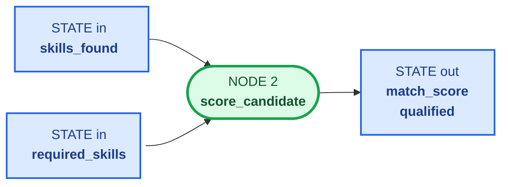


**Reads** skills_found + required_skills  ·  **Writes** match_score, qualified  ·  **Edge** → conditional (Section 8)

```python
PASS_THRESHOLD = 0.6


def score_candidate(state: RecruitmentState) -> dict:
    found = set(state.get("skills_found") or [])
    required = set(state["required_skills"])
    score = len(found & required) / len(required) if required else 0.0
    return {
        "match_score": round(score, 2),
        "qualified": score >= PASS_THRESHOLD,
    }
```

**Agent state** *(Anna Kowalski — after `score_candidate`)*


| Field             | Value                                              |
| ----------------- | -------------------------------------------------- |
| `candidate_name`  | `"Anna Kowalski"`                                  |
| `resume_text`     | `"5 years Python, FastAPI, SQL, Docker, pytest."`  |
| `job_title`       | `"Python Developer"`                               |
| `required_skills` | `["python", "sql", "fastapi"]`                     |
| `skills_found`    | `["python", "fastapi", "sql", "docker", "pytest"]` |
| `match_score`     | `1.0`                                              |
| `qualified`       | `true`                                             |
| `outcome`         | `null`                                             |
| `message`         | `null`                                             |


---

## 8 · EDGE (conditional) — pass or fail?

A **conditional edge** is an arrow that is *not* fixed. A small routing function looks at the state and returns a key; that key decides the next node.

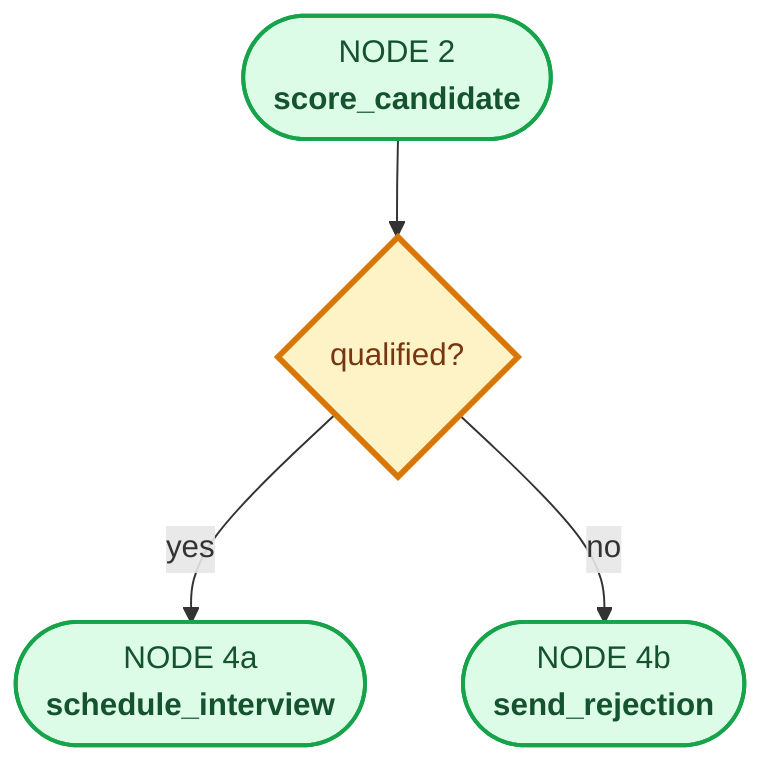


```python
def route_decision(state: RecruitmentState) -> str:
    """Read the state, return a key that maps to the next node."""
    return "interview" if state["qualified"] else "reject"


# Wired when building the graph:
graph.add_conditional_edges(
    "score_candidate",       # after this node ...
    route_decision,          # ... call this function ...
    {
        "interview": "schedule_interview",   # key -> node name
        "reject": "send_rejection",
    },
)
```

**Agent state** *(Anna — at routing; state unchanged, edge depends on `qualified`)*


| Field             | Value                                              |
| ----------------- | -------------------------------------------------- |
| `candidate_name`  | `"Anna Kowalski"`                                  |
| `resume_text`     | `"5 years Python, FastAPI, SQL, Docker, pytest."`  |
| `job_title`       | `"Python Developer"`                               |
| `required_skills` | `["python", "sql", "fastapi"]`                     |
| `skills_found`    | `["python", "fastapi", "sql", "docker", "pytest"]` |
| `match_score`     | `1.0`                                              |
| `qualified`       | `true` → edge `**schedule_interview`**             |
| `outcome`         | `null`                                             |
| `message`         | `null`                                             |


---

## 9 · EDGE to END — the rejection path

If the candidate fails, Node 4b writes a rejection message and a **fixed edge** sends the graph straight to `END`. Nothing else runs.

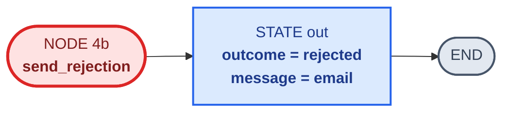


```python
def send_rejection(state: RecruitmentState) -> dict:
    return {
        "outcome": "rejected",
        "message": (
            f"Dear {state['candidate_name']}, thank you for applying. "
            f"Your match score was {state['match_score']:.0%}; "
            f"we will not be moving forward at this time."
        ),
    }


# Fixed edge: after rejection, stop.
graph.add_edge("send_rejection", END)
```

**Agent state** *(final — two paths)*


| Field             | Anna → `schedule_interview`                                | Mark → `send_rejection`                                 |
| ----------------- | ---------------------------------------------------------- | ------------------------------------------------------- |
| `candidate_name`  | `"Anna Kowalski"`                                          | `"Mark Nowak"`                                          |
| `resume_text`     | `"5 years Python, FastAPI, SQL, Docker, pytest."`          | `"Campaign planning, Excel reports, PowerPoint decks."` |
| `job_title`       | `"Python Developer"`                                       | `"Python Developer"`                                    |
| `required_skills` | `["python", "sql", "fastapi"]`                             | `["python", "sql", "fastapi"]`                          |
| `skills_found`    | `["python", "fastapi", "sql", "docker", "pytest"]`         | `[]`                                                    |
| `match_score`     | `1.0`                                                      | `0.0`                                                   |
| `qualified`       | `true`                                                     | `false`                                                 |
| `outcome`         | `"interview"`                                              | `"rejected"`                                            |
| `message`         | `"Interview booked for Anna Kowalski (Python Developer)."` | `"Dear Mark Nowak, match 0% — not proceeding."`         |


The **interview path** mirrors this: `schedule_interview` writes `outcome = "interview"`, then a fixed edge goes to `END`.

---

## 10 · Everything together — schema + code

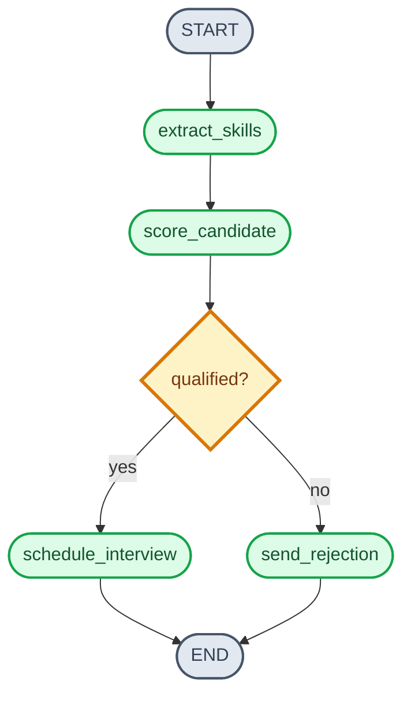


```python
from typing import Literal, TypedDict

from langgraph.graph import END, START, StateGraph


class RecruitmentState(TypedDict):
    candidate_name: str
    resume_text: str
    job_title: str
    required_skills: list[str]
    skills_found: list[str] | None
    match_score: float | None
    qualified: bool | None
    outcome: Literal["interview", "rejected"] | None
    message: str | None


KEYWORDS = {"python", "sql", "fastapi", "docker", "pytest", "langchain"}
PASS_THRESHOLD = 0.6


def extract_skills(state: RecruitmentState) -> dict:
    text = state["resume_text"].lower()
    return {"skills_found": [kw for kw in KEYWORDS if kw in text]}


def score_candidate(state: RecruitmentState) -> dict:
    found = set(state.get("skills_found") or [])
    required = set(state["required_skills"])
    score = len(found & required) / len(required) if required else 0.0
    return {"match_score": round(score, 2), "qualified": score >= PASS_THRESHOLD}


def schedule_interview(state: RecruitmentState) -> dict:
    return {
        "outcome": "interview",
        "message": f"Interview booked for {state['candidate_name']} ({state['job_title']}).",
    }


def send_rejection(state: RecruitmentState) -> dict:
    return {
        "outcome": "rejected",
        "message": f"Dear {state['candidate_name']}, match {state['match_score']:.0%} — not proceeding.",
    }


def route_decision(state: RecruitmentState) -> str:
    return "interview" if state["qualified"] else "reject"


graph = (
    StateGraph(RecruitmentState)
    .add_node("extract_skills", extract_skills)
    .add_node("score_candidate", score_candidate)
    .add_node("schedule_interview", schedule_interview)
    .add_node("send_rejection", send_rejection)
    .add_edge(START, "extract_skills")
    .add_edge("extract_skills", "score_candidate")
    .add_conditional_edges(
        "score_candidate",
        route_decision,
        {"interview": "schedule_interview", "reject": "send_rejection"},
    )
    .add_edge("schedule_interview", END)
    .add_edge("send_rejection", END)
    .compile()
)

result = graph.invoke(
    {
        "candidate_name": "Anna Kowalski",
        "resume_text": "5 years Python, FastAPI, SQL and Docker experience.",
        "job_title": "Python Developer",
        "required_skills": ["python", "sql", "fastapi"],
        "skills_found": None,
        "match_score": None,
        "qualified": None,
        "outcome": None,
        "message": None,
    }
)

print(result["outcome"])   # interview
print(result["message"])   # Interview booked for Anna Kowalski (Python Developer).
```

---

## 11 · MemorySaver — "Ctrl+S after every step"

**Problem:** the graph pauses or the server restarts. Without saving, you start over.  
**MemorySaver** is a checkpointer: after *each node finishes*, it stores a snapshot of the state under a `thread_id`.

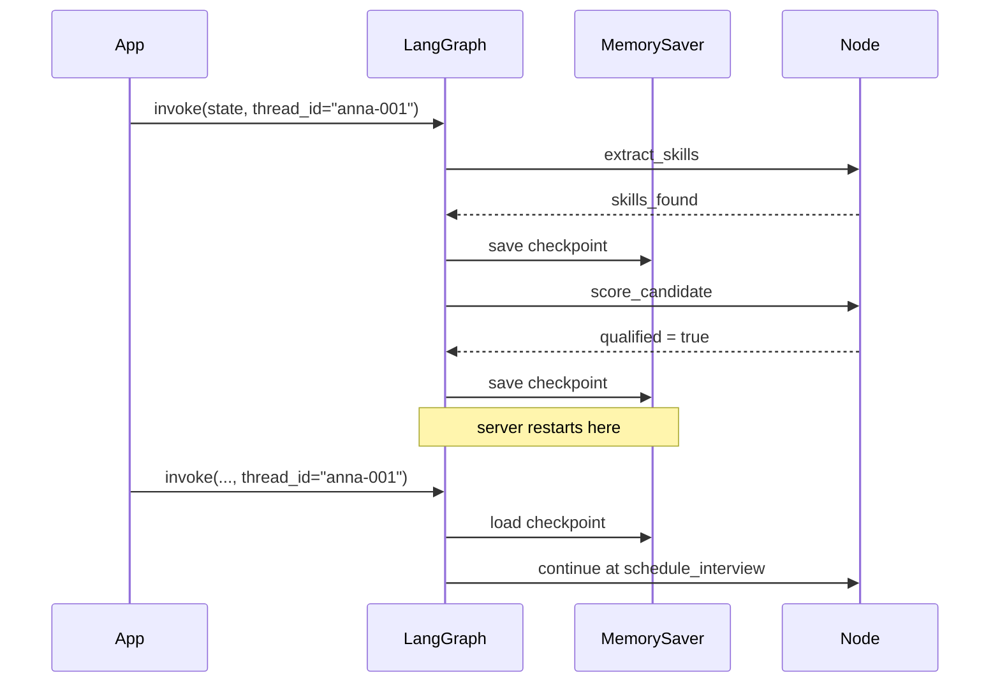


```python
from langgraph.checkpoint.memory import MemorySaver

app = graph.compile(checkpointer=MemorySaver())

config = {"configurable": {"thread_id": "anna-001"}}
result = app.invoke(initial_state, config)
```


|                    |                                                                                        |
| ------------------ | -------------------------------------------------------------------------------------- |
| **When it saves**  | After every node completes                                                             |
| **What it stores** | Full state snapshot + which node is next                                               |
| **How to resume**  | Re-invoke with the same `thread_id`                                                    |
| **Trade-off**      | In-memory is fast but lost on exit — production uses a DB checkpointer (e.g. Postgres) |


---

## 12 · RetryPolicy — "try again when the outside world glitches"

**Problem:** a node calls an external API (calendar, email) and the network blips.  
**RetryPolicy** wraps that node and re-runs it on transient errors — you do not write the loop.

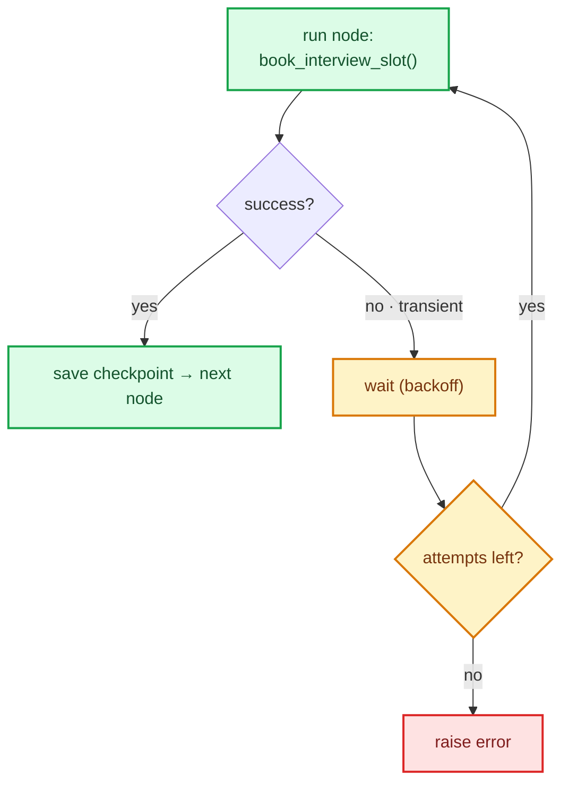


```python
from langgraph.types import RetryPolicy

graph.add_node(
    "schedule_interview",
    schedule_interview,
    retry_policy=RetryPolicy(
        max_attempts=3,       # try up to 3 times
        initial_interval=1.0,  # wait 1s, then 2s, then 4s
    ),
)
```


|                    |                                                                               |
| ------------------ | ----------------------------------------------------------------------------- |
| **Retries on**     | Transient failures — timeout, rate limit, 503                                 |
| **Does NOT retry** | Logic / auth / bad-input errors (those need a code fix)                       |
| **Behaviour**      | Re-runs the node from its start; state is untouched until success             |
| **Pairs with**     | `MemorySaver` — if every retry fails, the last good checkpoint is still saved |


---

## 13 · Recap


|                                                                                                                                                |                                                                                                             |
| ---------------------------------------------------------------------------------------------------------------------------------------------- | ----------------------------------------------------------------------------------------------------------- |
| Why LangGraph- Fewer tool choices per step → fewer mistakes- Explicit flow you can read, test and debug- Pause, resume and retry are built in | The three pieces- **State** — the information notebook- **Node** — one action- **Edge** — where to go next |


**Next:** open [01_langgraph.ipynb](./01_langgraph.ipynb) and run the graph yourself.  
Official reference: [Thinking in LangGraph](https://docs.langchain.com/oss/python/langgraph/thinking-in-langgraph)